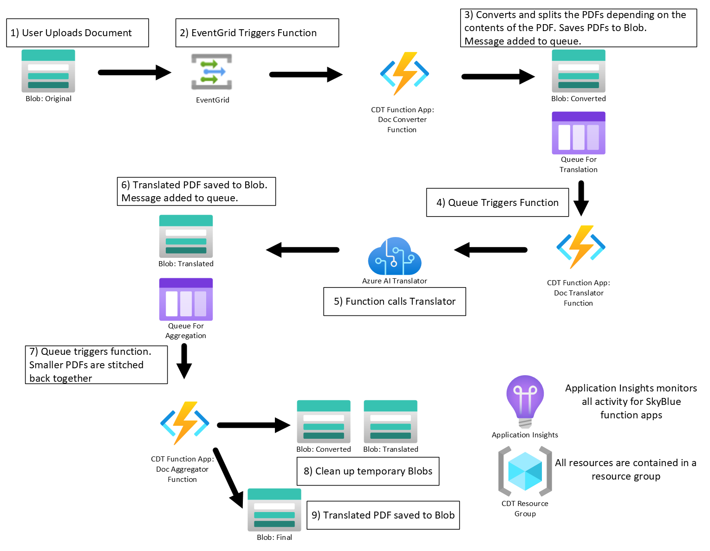

# Translate documents using Azure Document Translation

Azure Document Translation service enables the translation of multiple and complex documents across all supported languages and dialects while preserving the original document structure and data format. However, it currently does not support the translation of text from images in digital documents. To address this, there are two options:
* Convert the document into a scanned document in its entirety.
* Split the document into two files and process them separately:
    * One file containing all pages that only have text. The digital pages are preserved in their original form. The Document Translation service takes advantage of the structure/layout information from the digital text page and translates it more accurately than a scanned page.
    * The second file will contain a scanned version of all the pages that contain images.

## Dealing with various File Types  
You will need to handle different file types as follows:
* PDF
    * Scanned PDF:You do not need to do anything. Translator service translates all the text from the scanned pages.
    * Digital PDF: As mentioned earlier, the Translator service does not translate text from images, but it can translate the remaining text.
    * This solution analyzes each page and creates multiple files based on the content on each page (text only page, text plus image page, image only page, etc.). You can configure this behavior through various parameters. The following files will be created:
        * A copy of the original file as is.
        * A scanned version of the whole document.
        * Two other files: One containing all pages that only have text, and a second file with a scanned version of all the pages that contain image(s).
        * Note: The Azure Document Translator has a limit of 40MB per document. The scanned version of the file is typically larger. Therefore, we split the scanned document into multiple files based on the number of pages (configurable).
* Image Files(BMP,PNG,JPG)
    * We need to convert these files into PDF, and this solution takes care of it.
* Office files (Word, Powerpoint, Excel)
    * The Translator service handles these files in the same way as PDF, meaning it does not translate text from images but translates the remaining text. Therefore, we need to convert/process these files in the same way as PDF. One approach is to convert office files into PDF and leverage the solution we have for PDF. 
    * There are several open-source Python packages available to convert office documents, but some of them require Microsoft Office to be installed on the machine where the code runs. You can explore the following options
        * https://pypi.org/project/aspose-words/
        * https://github.com/AlJohri/docx2pdf
        * You can also leverage Power Apps, as long as the files are stored in OneDrive.

## Solution Approach  
We followed the approach outlined below and have shared all the code in this repository:

We have three functions here
*   docconvertorfnction
*   doctranslatorfunction
*   docaggregatorfunction

## Document Convertor Function

This function [triggered using an event subscription from the storage container.](https://learn.microsoft.com/en-us/azure/azure-functions/functions-event-grid-blob-trigger?pivots=programming-language-python)
There are multiple python packages that convert digital PDF to Scanned version of PDF. We have played with PyMuPDF and  pdf2image python packages. For each of those packages, we shared the code for Azure functions based on them. 

* The pdf2image function requires Docker because we need to install Poppler utils, which is not available as a Python package. This function only supports converting the PDF document to a scanned version.This function is available [here.](https://github.com/smallangi/AllAboutUnstructuredData/tree/main/DocumentTranslation/docconvertorfunction-pdf2image)
* The docconvertorfnction in this repository is based on PyMuPDF and have extensive functionality and configurable options. The following are the configurations available:
    * "pdf_conversion": options include "all", "scanned", "original", or "hybrid".
        * "scanned": creates a scanned version of the document. The name of the scanned file will have "--scanned" appended to the original file.
        * "original": copies the original document.
        * hybrid: 
            * For pages with text only data, create a file with the digital copy of the pages. Name of the text pages file will have "--CustDocTranslatorMappedTextOnlyPages" appended to original file. Note that if the document has no pages with only text, this file will not be created.
            * For pages with images or images and text, create a file with the scanned version of the pages. We will create a seperate scanned file for a specfied number of pages. The name of the image pages files will have "--CustDocTranslatorMappedScannedPart-XXX" appended to the original file. Note that if the document has no pages with images, these files will not be created.
            * We will also create a mapping file with the name"--CustDocTranslatorMapping.csv" appended to original file. This file will have page mapping between the original file and these generated files so that we can stitch them back after the translation to create final translated file.
            * Note: This solution also copies the original file as is with hybrid approach. This way we have the original file translation along with the translation of converted file.
        * "all": creates all of the above. 
    * "pdf_page_limit": the number of pages in one file for the scanned version.
        * There is a limit of 40MB per file for Azure Document Translator. Adjust this page number based on the type of PDF files you are dealing with.
    * "queue_name": " Name of the queue for Translation jobs"
    * "document_storage_connstr": Connection string for storage account that will have all the files(original, converted, translated etc)
    * "document_storage": "URL for the document storage in the format https://xxxxxxxxx.blob.core.usgovcloudapi.net"
    * "converted_container": "The output container for converted documents"
    * "mapping_file_container": "Name of the Container that will have generated mapping file"    

### Note
* Hybrid is the best option. This is because Translator can translate digital pages better than images as it can get the proper word block and full layout information. 

## Document Translator Function
The Document Translator Function is the second function to be called in the document translation process.  This function is triggered when a message is written to Azure Queue called, "QueueForTranslation", indicating that a document is ready to be sent to the Azure AI Translator Service.  The queue message contains the information required by the translator service which is "Source Language", "Target Language", "File Name", "File URL".  The function will first check to see if a glossary exists for the target language.  The Azure AI Translator service has an optional glossary parameter to help translate unique words or acronyms that would not normally be translated.  Note: The value of "other" can be used for the source language if it is unknown. 
Next, the function will call the translator service and wait for a reponse. If the translation process was successful, then a message will be written to another Azure Queue called, "QueueForAggregation". Documents that contain more pages than the configured amount are broken into smaller documents.  (The configuration setting is called "pdf_page_limit" and the default is 10 pages.)  The function will wait for all parts of the document to be translated before writing a message to QueueForAggregation. 

The following are the configurations used by the Document Translator Function: 
* "converteddocs_storage": "storage connection string for input documents",
* "translator_endpoint":"translator service endpoint",
* "translator_key":"translator key",
* "target_blob_url":"target blob url for translated output"
* "glossary_connstr": "connection for glossary storage"
* "glossary_storage": "storage account for glossary"
* "glossary_container": "container name for glossary"

## Document Aggregator Function
The Document Aggregator Function is the final function to be called in the document translation process.  This function is triggered when a message is writted to the Azure Queue called, "QueueForAggregation", indicating that all the parts of a document have been successfully translated.  The queue message contains the location of the translated documents.  In the Hybrid Translation process, a document is split into digital and scanned sections to optimize results.  The Document Aggregator Function will "stitch" these sections back together, in correct page order, taking pages from either the digital translated document or the scanned translated document.  The function uses a "mapping" file which indicates which translated document to use for a specific page. This process ensures that the most accurate translation is used for a single page and also ensures that the text layout is maintained correctly.  Once the final document has been "stitched" back together it is written to the configured storage container.

The following are the configurations used by the Document Aggregator Function: 
* "mapping_file_container": "storage container for the mapping file",
* "final_container": "storage container for the final translated document",
* "translated_container": "storage container for the translated document sections that are stitched together to produce the final document",

## Deployment    

To deploy this solution, follow these steps:
1. Create an Azure Translation Service and configure it for [Authentication and authorization](https://learn.microsoft.com/en-us/azure/ai-services/translator/document-translation/how-to-guides/create-use-managed-identities)
2. Create a Storage account to store the original/converted/translated documents, gloassries and mapping files.
    * Create containers and make sure that the container names match with names mentioned in the Function App configuration.
    * Create Storage queues "queuefortranslation"(for Translation) and  "queueforaggregation" (for final aggregation) and make sure that translation queue matches with the name mentioned in the Function App configuration.
3. Create Azure Functions based on the source code from this repository. [Refer to this article to create functions that leverage storage container's event subscription ](https://learn.microsoft.com/en-us/azure/azure-functions/functions-event-grid-blob-trigger?pivots=programming-language-python)
    * docconvertorfnction gets triggered by Storage acct's event subscription. 
    * doctranslatorfunction and docaggregatorfunction gets triggered by storage queues. 

## Contributors
+ Richard Posada
+ Sreedhar Mallangi 
